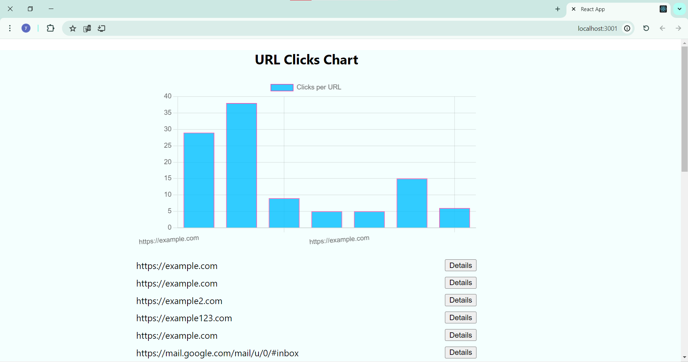
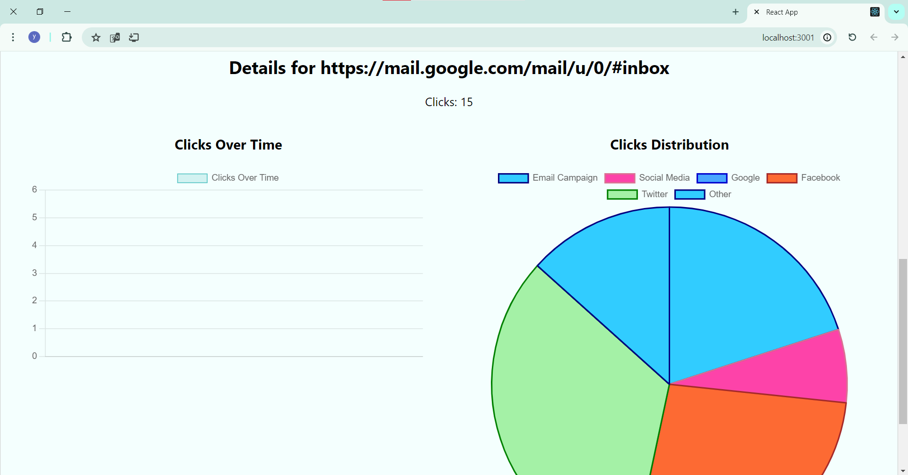

# ClickLink Service

The ClickLink Service is a URL shortening platform with tracking capabilities. It offers a server-side API for link and user management, along with a client-side application for visualization and interaction. Through the API, users can create, retrieve, update, and delete links and users. The client application enables users to generate new links, view link details, and analyze click data.
### Images




## Server-Side API (ClickLink)

### Description

The server-side API is built with Node.js and Express, using MongoDB as the database. It provides endpoints for managing users and links, including creation, retrieval, updating, and deletion.

### Installation

1. Clone the repository:
2. 
   ```bash
   git clone https://github.com/yourusername/ClickLink.git
   ```
   
3. Navigate to the project folder:

     ```bash
     cd ClickLink
     ```

4. Install dependencies for the server:

      ```bash
       cd ClickLink
       npm install
       npm start
      ```
## Client-Side Application
### Description:
The client-side application is built with React and includes visualizations using the Chart.js library.
1. Navigate to the client folder:

      ```bash
      cd ClickLink/click-link-client
      npm install
      npm start

      ```
2. Install dependencies for the client:
      ```bash
      npm install
      npm start

      ```

 ### Usage
 Once the client is running, you can access the application in your web browser.
 It provides a user interface for interacting with the ClickLink service,
 including creating new links, viewing link details, and analyzing click data.
